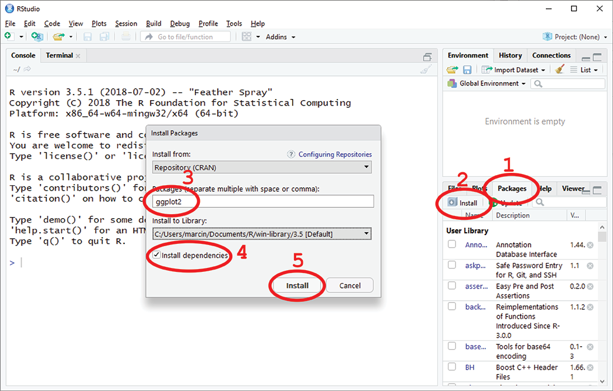

<style type="text/css">
.column {
  float: left;
}
.left {
}
.right {
  width: 247px;
  float: right;
}
.row:after {
  content: "";
  display: table;
  clear: both;
}

.table{
  width: 60%;
  margin-left: 20%; 
  margin-right: 20%;
}
.table th{
  text-align: left;
  background: lightgrey;
  border: 1px solid blue;
}

tbody th{
  padding: 5px;
  text-align: center;
  background: lightgrey;
  color: black
}
tbody td{
  padding: 5px;
  text-align: left;
  background: white;
  color: black
  border: 1px solid blue;
}

blockquote:before{
  display: block;
  position:relative;
  left: -0.55em;
  top: -0.3em;
  height: 0px;
  content: "!";
  font-size: 2em;
  color: #a00;
}
blockquote{
  border-bottom: 1px solid #ccc;
  border-left: 10px solid #ccc;
  border-radius: 5px;
  padding: 0.5em 0.5em;
  font-size: 1em;
}

#TOC:before{
  font-size: 1.5em;
  padding-left: 0.25em;
  content: "Contents";
}
#TOC{
  border: 2px solid #b0d0d0;
  padding: 1em 0.25em;
  border-radius: 5px
}

.footer{
  text-align: center;
  font-size: 150%;
}
.footer img{
  height: 1em;
}
</style>

<br>
<div style="border: 2px solid #b0d0d0; background-color: #e8f8f8; padding: 1em 0.25em; border-radius: 5px">
This document was created in R Markdown (http://rmarkdown.rstudio.com, http://rmarkdown.rstudio.com/articles_intro.html). R Markdown documents can be easily created in RStudio.
</div>

# Learning Objectives

* Basic concepts and skills
    * Getting familiar with RStudio
        * Panels in RStudio IDE (Integrated Development Environment)
        * Concept of RStudio Project and creating a new one
        * Creating new script file
        * Running script line-by-line
    * Proper commenting of the code
    * Using R as calculator
    * Getting Help
    * Variable and data types
        * naming variables
        * listing and removing variables
    * Operators
        * Arithmetic
        * Logical
    * Homogenous Data Structures
        * vectors
        * matrices
    * Heterogeneous Data Structures
        * Data frames
        * Lists
    * Installing a package


# Our Example Project: Eccology of Golden Orb-Weaver Spiders
We will get a taste of how to analyze data in R by working with data from (a fictionary) project on Golden Orb-Weaver spiders. The research objective of this project is to compare spider populations living in different climate zones in Australia. We will compare body weight of a spider to the diameter of the web the spider weaves and asses if it is true that:

1. Bigger and heavier spiders make larger webs.
2. The climate where spiders live has an effect on their weight and size of the web.

We will learn how to load data, calculate basic statistics, and test hypothesis for statistical significance. In the process we will create some plots and graphs.  
But before we start all of it, we first need to get a bit more familiar with R and RStudio.


# Introduction


## What is R?
<font size="+1">**R**</font> is an open source programming language and software environment for statistical computing and graphics that is supported by the R Foundation for Statistical Computing. The R language is widely used among statisticians and data miners for developing statistical software and data analysis. 

R and its libraries implement a wide variety of statistical and graphical techniques, including linear and nonlinear modeling, classical statistical tests, time-series analysis, classification, clustering, and others.  

R is easily extendable through functions and modules, and the R community is noted for its active contributions in terms of packages.  

Many of R's standard functions are written in R itself, which makes it easy for users to follow the algorithmic choices made. For computationally intensive tasks, C, C++, and Fortran code can be linked and called at run-time (quoted from [R - programming language](https://en.wikipedia.org/wiki/R_(programming_language))). You can download and install R from [here](https://cran.rstudio.com/).


## What is RStudio?
R Studio (written as RStudio without the space) is a free and open-source Integrated Development Environment (IDE) for R. You can download RStudio from [here](https://www.rstudio.com/products/rstudio/download/#download). RStudio makes our expirience with R easier, but it is not necessary to program in R.


## First steps

### Calculator
Almost all introductory R courses begin from using R as a calculator... We will do the same. Let's type the formulas (expressions) below and click \<Ctrl-ENTER\> on PC or \<Cmd-ENTER\> on Mac.
```{r}
#now, we use R as a calculator (order of operators is: (), ^, /, *, +, -):
2 + 2

#we can force the order using parenthesises
3 + 5 * 2 ^ 2
(1 + 2) * 3

#or use scientific notation
2e-4 + 1e-6
```

We can use bulit-in functions
```{r}
log(1)
log10(100)
sin(1)
sin(pi)
```

Our R-calculator can plot!
```{r}
curve(sin, from = 0, to = 2 * pi, n = 100)

#we can use more complicated expression which uses 'x' as a variable
curve(x^2 * log(x) * sin(x), from = 0, to = 2 * pi, n = 100)
```

R can also work with text:
```{r}
#output text
"Hello World!"

#use bulit-in function print() to print:
print("Hello World!")

#concatenate parts to get one string of text:
print(paste("Answer to", "the Ultimate Question of Life, the Universe, and Everything is", 2^5 + 2^3 + 2^1))
```

### HELP!!!
How to get help in R:

https://www.r-project.org/help.html


* use function ```help()```
```{r, eval=F}
help("print")
```

* instead of ```help()``` you can use ```?``` shortcut
```{r, eval=F}
? print
```

* or use ```??``` to search the help topics
```{r, eval=F}
??print
```

### Variables and data types

We have already mentioned variables. Now, we will have a closer look at them and the **assignments**.

We can assign numerical values or results of numerical operations:
```{r}
x <- 1 / 10   #'<-' is an assignment operator; you can enter it with one keystroke as Alt + _ (underscore)
x
x <- 1000   #notice how RStudio updates its description of x on the top right 'Environment' tab
x < - 10    # ***** BE CAREFUL WITH SPACES!!!! *****
x
log10(x)
2 * x
```

Variables do not need to be only numbers. We can use different _data types_:
```{r}
isGood    = TRUE      #logical or boolean
myNumber  = 0.25      #numeric float or double
myInteger = 2L        #numeric integer or long
myName    = "Marcin"  #character or text
```

To check type of the data use the ```typeof()``` function
```{r}
typeof(isGood)
typeof(myNumber)
typeof(myName)
```

Not all names of variables are equally good. Variable names can contain letters (upper and lower), numbers (but they can't start with a digit), underscores, and dots (but if they start from a dot they are 'hidden'):
```{r, eval=F}
#examples of bad variable names
12_from_the_left <- 12     #starting with a number
my name <- "Marcin"        #contains space
me@home <- 2               #contains non-alphanumeric symbol
```


We have learnt that a variable is created when a value is assigned to if for the first time. But how to list all the variables? How to delete variables?  \
To list variables we use the _list_ functions `ls()` (or we can consult the **Environment** panel in RStudio).

```{r}
ls()

```

To _remove_ a variable we use remove function `rm()` (or use the _broom_ icon in the **Environment** panel in RStudio).
```{r}
rm(myName)

#to remove all variables we use
rm(list = ls())
```

Do you know how the `rm(list = ls())` actually worked?  
How to delete a sub-set of variables using one rm() function?

### Relational Operators
Relational operators are used to compare objects, e.g. variables, numbers. The result is a logical value -  `TRUE` or `FALSE`.
```{r}
#exactly equal:
1 == 1   #please note the doube '='
1 == 0

#less than:
1 < 0


#more than:
1 > 0

#more than or equal:
1 >= 0

#less then or equal:
1.2 <= 1.2
```


### Logical operators

Logical operators are used to carry out Boolean operations like `AND`, `OR`, `NOT`.

<table align="center" border="1" cellpadding="50">
<caption>`OR` operator, symbol `|`</caption>
<tr>
<th>A</th>
<th>B</th>
<th>A | B</th>
</tr>
<tr>
<td>`FALSE`</td>
<td>`FALSE`</td>
<td>`FALSE`</td>
</tr>
<tr>
<td>`FALSE`</td>
<td>`TRUE`</td>
<td>`TRUE`</td>
</tr>
<tr>
<td>`TRUE`</td>
<td>`FALSE`</td>
<td>`TRUE`</td>
</tr>
<td>`TRUE`</td>
<td>`TRUE`</td>
<td>`TRUE`</td>
</tr>
</table>
<br>

<table align="center" border="1" cellpadding="50">
<caption>`AND` operator, symbol `&`</caption>
<tr>
<th>A</th>
<th>B</th>
<th>A & B</th>
</tr>
<tr>
<td>`FALSE`</td>
<td>`FALSE`</td>
<td>`FALSE`</td>
</tr>
<tr>
<td>`FALSE`</td>
<td>`TRUE`</td>
<td>`FALSE`</td>
</tr>
<tr>
<td>`TRUE`</td>
<td>`FALSE`</td>
<td>`FALSE`</td>
</tr>
<td>`TRUE`</td>
<td>`TRUE`</td>
<td>`TRUE`</td>
</tr>
</table>
<br>

<table align="center" border="1" cellpadding="50">
<caption>`NOT` operator, symbol `!`</caption>
<tr>
<th>A</th>
<th>!A</th>
</tr>
<tr>
<td>`FALSE`</td>
<td>`TRUE`</td>
</tr>
<tr>
<td>`TRUE`</td>
<td>`FALSE`</td>
</tr>
</table>
<br>
Let's give the logical opeartors a try:
```{r}
#simple comparisons, no logical operators:
1 > 0
1 > 2

#logical OR:
1 > 0 | 1 > 2

#logical AND:
1 > 0 & 1 > 2

#logical NOT:
!(1 > 0)
```

###Operator Precedence and Associativity

As we all remember from our preschool algebra classes operators have their 'priority' or _precedence_ - the order in which they are used in calculations. The table below is a short summary of precedencing order of the more common operators in R.

> It's always possible to force the precedence with the parentheses: `(` `)`

<table align="center" border="1" cellpadding="50">
<tr>
<th>Operator</th>
<th>Description</th>
<th>Associativity</th>
</tr>
<tr>
<td>^, **</td>
<td>Exponent</td>
<td>Right to Left</td>
</tr>
<tr>
<td>-x, +x</td>
<td>Unary minus, Unary plus</td>
<td>Left to Right</td>
</tr>
<tr>
<td>:</td>
<td>sequence</td>
<td>Left to Right</td>
</tr>
<tr>
<td>%_any_%</td>
<td>_special_ operators, e.g. %in%, %*%</td>
<td>Left to Right</td>
</tr>
<tr>
<td>*, /</td>
<td>Multiplication, Division</td>
<td>Left to Right</td>
</tr>
<tr>
<td>+, &#8211;</td>
<td>Addition, Subtraction</td>
<td>Left to Right</td>
</tr>
<tr>
<td>&lt;, &gt;, &lt;=, &gt;=, ==, !=</td>
<td>Comparisions</td>
<td>Left to Right</td>
</tr>
<tr>
<td>!</td>
<td>Logical NOT</td>
<td>Left to Right</td>
</tr>
<tr>
<td>&amp;</td>
<td>Logical AND</td>
<td>Left to Right</td>
</tr>
<tr>
<td>|</td>
<td>Logical OR</td>
<td>Left to Right</td>
</tr>
<tr>
<td>-&gt;, -&gt;&gt;</td>
<td>Rightward assignment</td>
<td>Left to Right</td>
</tr>
<tr>
<td>&lt;-, &lt;&lt;-</td>
<td>Leftward assignment</td>
<td>Right to Left</td>
</tr>
<tr>
<td>=</td>
<td>Leftward assignment</td>
<td>Right to Left</td>
</tr>
</table>

### Data structures

#### Vectors

When we perform an operation on a number (or text) we actually do not perform it an a single value (called **_scalar_** in computer jargon). We perform it on a sequence of values (called **_vector_**). Scalar is a single element or value; scalar can not ever _expand_ to more than one value. Vector (called _atomic vector_) is the simplest data structure in R and can store one or more elements or values of the same type.  
So far we were using vectors containing just one element.  

When we type:
```{r}
v <- 11
v
```
We create a vector with a single element, 11.  
How to create a vector with more than one numerical element?

$$
v = \begin{pmatrix}1, 2, 3, 4, 5, 6, 7, 8, 9, ..., 121\end{pmatrix}
$$
Or a vector with several character elements?
$$
v = \begin{pmatrix}"one", "two", "three", "last"\end{pmatrix}
$$

There is more than one way to create a vector ;)  \
<br>
The colon `:` **sequence operator**:
```{r}
#create vector from sequence of numbers, e.g. from 11 to 121
v <- 1:121
v

#or from 121 to 1
v <- 121:1
v
```
The **sequence function** `seq`:
```{r}
#when we need the 'step' between consecutive elements to be different than 1 (or -1), e.g. 2?
v <- seq(from = 1, to = 121, by = 2)
v

```
The **combine function** `c()`:
```{r}
#to create a vector manually by entering the elements one-by-one
v <- c(1, 3, 7, -1)
v
```

```{r}
#What data type is the vector of?
typeof(v)

#by the way, using c() we can create a vector of characters
v <- c('one', 'two', 'last')
v
```

Vector is a **_homogeneous_** data structure meaning it can contain only elements of the same type (e.g. only numbers, or only character).  
What will happen if we create a following vector:
```{r}
v <- c(1, 3, 4, 5, 6, 'last')
v
#check the data type:
typeof(v)
```
What has happened is called **type _coercion_** - the variable's data type was _coerced_ to the type suitable to store all the types of enetered elements.

#### Vectorization

Vectorization means that when an operation is performed on a vector it involves all elements in that vector (not e.g. only the first element). All R functions (and operators) are _vectorized_ - they operate on vectors. ***In R there are no scalars - only vectors***. 
```{r}
#lets first check simple arithmetic operators:
a <- 1:6
b <- 3:8
a
b
a + b
a * b
```

So, how to multiply a multi-element vector by a single-element vector representing scalar?:
```{r}
a <- 2
b <- 3:8
a
b
```

What will happen and why?
```{r}
a * b
```

What actually happened is: The shorter vector _a_ was _recycled_ as many times as necessary to match length of the longer vector _b_. As _a_ has only 1 element it was an equivalent of multiplying _b_ by scalar _a_.

#### Matrices

Now, lets quickly introduce a matrix. \
Matrix is a collection of elements arranged in a 2D rectangular layout. It is a vector where each element is a vector of the same length. All the matrix elements must be the same type (e.g. all numbers or all text, same as with vectors). In most cases, to be able to use **_matrix algebra_** we will use numeric matrices.  \
To create a matrix in R we can use the function `matrix()`. The matrix function needs to know:

* Shape of the matrix - number of rows and columns.
* Value of the elements - a vector with as many elements as there are _cells_ in the matrix.
* Filling order - how to fill the matrix with the elements, by columns or by rows.

Lets create a 4x3 matrix variable called _M_ filled with integer numbers from 1 to 12:

$$
M = \begin{pmatrix}1 & 2 & 3 & 4 \\ 5 & 6 & 7 & 8 \\ 9 & 10 & 11 & 12\end{pmatrix}
$$
```{r}
M <- matrix(1:12, nrow = 3, ncol = 4, byrow = TRUE)
M
```

We can check data type of a matrix. And check the dimensions with functions `dim()`, `nrow()`, and `ncol()`.

```{r}
typeof(M)

#check the size of the matrix:
dim(M)   # rows and columns
nrow(M)  # only rows
ncol(M)  # only columns
```

R has a powerful matrix algebra system. Matrices can be added, multiplied, inverted, a product, determinant or eigenvalue calculated. Matrix algebra can be easily used to solve systems of linear equations. More reading on matrix algebra in R can be found e.g. [here]( https://www.statmethods.net/advstats/matrix.html).

#### Data frames

Data frames are heterogeneous equivalents of matrices (heterogeneous means they can store data of various types): Each column can be of different data type, but within each column, all rows must be of the same data type. A bit like a simple spreadsheet (e.g. in Excel). Data frames are the basic, most comonly used data structures for storing and analyzing of the experimental data.  \
So, let's create a data frame with data as in the table below:

<br>
<table align="center" border="1" cellpadding="50">
<tr>
  <th>animal</th><th>feel</th><th>weight</th>
</tr>
<tr>
  <td>dog</td><td>furry</td><td style="text-align:right">22</td>
</tr>
<tr>
  <td>cat</td><td>furry</td><td style="text-align:right">4</td>
</tr>
<tr>
  <td>sea cucumber</td><td>squishy</td><td style="text-align:right">1.1</td>
</tr>
<tr>
  <td>sea urchin</td><td>spiny</td><td style="text-align:right">0.5</td>
</tr>
</table>
<br>
To create a data frame we use a function called... `data.frame`.  \
We need to specify each column as a separate vector. All the vectores (columns) need the have the same number of elements (rows)
```{r}
animals <- data.frame(animal = c("dog",   "cat",   "sea cucumber", "sea urchin"),
                        feel = c("furry", "furry", "squishy",      "spiny"),
                      weight = c(45,      8,       1.1,            0.8)
)

animals
```


Now, when we have our data in the `data.frame` structure we can save it as a file. \
R can work with many data file formats but the most popular ones are text files with fields separated either by a \<TAB\> or ',' (coma). Those formats are know as 'tab-separated values' (TSV) and 'coma-separated values' (CSV).
To save our `data.frame` as a file we can use the function `write.table()`.

```{r}
write.table(animals, file = "animals.tsv", sep = "\t", col.names = TRUE, row.names = FALSE, quote = FALSE)
```

> Arguments to specify when writing a data.frame as a file:
>
> * file - name of the file
> * sep  - character to use as a separator, \\t is tabulator
> * col.names - save column names?
> * row.names - save row names?
> * quote - surround non-numeric values in double-quotes?

Having the file created, we can now read the data back from file to a `data.frame` with function `read.table()`
```{r}
animals <- read.table(file = "animals.tsv", sep = "\t", header = TRUE)
```

Data frame and matrix can be converted into each other with functions `as.matrix()`, to convert `data.frame` into `matrix` or `as.data.frame()` to do the oposite.  \


> Remember that `data.frame` is **heterogeneous** but `matrix` is **homogenous**. Conversion of `data.frame` into `matrix` **may result in type coercion**.

#### Subsetting and Indexing

Now we know (sort of) how to perform operation of vectors, matrices and data.frames. But how to access specific elements in vectors or rows or columns of data in data frames? Rephrasing: How to **subset** a data structure?  

Subsetting is done with use of indices. To access _n^th^_ element of a vector _v_ we use notation: _v_[_n_]. `[ ]` is the _indexing operator_.

```{r}
v <- 1:10     #create a vector with integer numbers from 1 to 10
v
#get 1st element
v[1]
#get 7th element
v[7]

#get elements from 3 to 6
v[3:6]
```

Similarly we use indeces to access elements in matrix; only this time we need to use two indices - **first for the row**, and **second for the column**.  \
Lets get back to our matrix _M_:
$$
M = \begin{pmatrix}1 & 2 & 3 & 4 \\ 5 & 6 & 7 & 8 \\ 9 & 10 & 11 & 12\end{pmatrix}
$$

```{r}
M <- matrix(1:12, nrow = 3, ncol = 4, byrow = TRUE)
M

#get element in second row, third column
M[2, 3]

#to get all elements from a row or a column simply ommit row or column index:
M[2, ]    #returns second row as a vector
M[, 3]    #return third column as a vector
```
<br>
Data frames can be indexed in the same way as matrices using the `[ ]` operator. Additionally the columns in the data frames may be accessed with the _dollar_ `$` operator.  \
Lets go back to the `animals` data frame:

<br>
<table align="center" border="1" cellpadding="50">
<tr>
  <th>animal</th><th>feel</th><th>weight</th>
</tr>
<tr>
  <td>dog</td><td>furry</td><td style="text-align:right">22</td>
</tr>
<tr>
  <td>cat</td><td>furry</td><td style="text-align:right">4</td>
</tr>
<tr>
  <td>sea cucumber</td><td>squishy</td><td style="text-align:right">1.1</td>
</tr>
<tr>
  <td>sea urchin</td><td>spiny</td><td style="text-align:right">0.5</td>
</tr>
</table>
<br>

To access the columns we use `$`:
```{r}
animals$animal   #to access column animal
animals$feel     #to access column feel
animals$weight   #to access column weight
```

Each column in a data frame is a _vector_, so we can use logical expressions, e.g.:
```{r}
animals$weight >= 4
```

And now, nothing can stop us from using this expression to index, **subset** the data frame:
```{r}
animals[animals$weight >= 4, ]
```
> Remember, first index is for rows, second is for columns. When an index is missing it means _return all_. In the example above we are selecting, or _subsetting_ rows and getting all the collumns.

<br>

# Golden Orb-Weaver Spider Project

Finally, we can start working on the data from our project!

<center>


</center>

<br>
<span style="font-size:150%">Scenario:</span> We are part of a team studding Ecology of Golden Orb-Weaver spiders (_Nephila edulis_). The research objective is to compare spider populations living in different climate zones in Australia:  

- Cool-Temperature Inland - Canberra, ACT
- Mid-Temperature Coastal - Jervis Bay, ACT
- Alpine - Cooma, NSW  

The plan is to compare body weight of the spider with the diameter of the web the spider weaves and asses two hypothesis:  

1. Bigger and heavier spiders make larger webs.
2. The climate where spiders live affects weight of the spiders and the size of their webs.

Our colleagues have already went to the wild and sampled 100 spiders at each location. They weighted the spiders and they measured the diameter of their webs.  
Each sample (spider data) includes following information:  

- spider_id - identifier of the spider (sp_1, sp_2, sp_3...),
- population - location where the spider was assesd (canberra, cooma, jervis),
- web_dia - diameter of the web the spider weaved (numerical values),
- weight - weight of the spider (numerical values).

We are **The Quantitative Researcher** in the team - this is our task to process and analyze the data:  

- Present the data in graphical format on series of explanatory plots and graphs.
- Perform statistical test to prove that the climate indeed affects the size of the web.
- When performing our research we must adhere the most important rule of science - **The Reproducibility**. We will create a workflow, a program in R which can be re-run to reproduce our findings.


## Get the data

1. Download the project data file 'spider_web.tsv' from [https://github.com/numicator/ANU_Student_Research_Conference/raw/master/spider.tsv](https://github.com/numicator/ANU_Student_Research_Conference/raw/master/spider.tsv) and save it in your project's directory.  
2. Load data from "spider.tsv" file into data frame named variable `spider`.

Ensure that you checked:  

* What is the column separator character?
* Does the file have a header?

```{r, echo=T}
# load the data file into data frame
spider <- read.table("spider.tsv", sep = "\t", header = TRUE)
```

> It is also possible to use the *Import Dataset* feature from the **Environment** panel in RStudio.

## Quick data exploration:

* Check that the variable `spider` is indeed a `data.frame` with function `class()`.
* Reveal structure of the data frames with `str()` function.
* Print 5 first rows of the data with the `head()` function.
* Get basic statistics of the data with the `summary()` function.
* Print number of rows in the data frame with the `nrow()` function.  
* **See** the data - generate _basic_ plots.
    
Checking that `spider`is a `data.frame` object:
```{r, echo=T}
print(paste("spider variable is", class(spider)))
```

Revealing its internal structure
```{r, echo=T}
print("spider structure:")
str(spider)
```

Printing out a few first rows
```{r, echo=T}
print("spider:")
head(spider, n = 5)
```

Number of rows in the data frame:
```{r, echo=T}
nrow(spider)
```

> You can also use features of the **Environment** panel: Check the structure of the data frame and view the data in RStudio data viewer. <center><br></center>


## Calculate basic statistics:

Calculate mean and standard deviation for columns `web_dia` and `weight`.

```{r, echo=T}
print("mean and sd from web_dia")
mean(spider$web_dia)
sd(spider$web_dia)
density(spider$web_dia)

print("mean and sd from weight")
mean(spider$weight)
sd(spider$weight)
density(spider$weight)
```

We can also quickly get _basic statistics_ with function `summary()`:
```{r, echo=T}
summary(spider)
```

Now a real chellenge: How to perform the same calculations as above, but using data from only the Canberra population?  \ We will subset rows of our data using indexing _by logical expression_. We will also access the column (web_dia or weight) indexing _by name of the column_.

```{r, echo=T}
print("mean and sd from web_dia for canberra")
mean(spider[spider$population == "canberra", "web_dia"]) 
sd(spider[spider$population == "canberra", "web_dia"])

print("mean and sd from weight for canberra")
mean(spider[spider$population == "canberra", "weight"])
sd(spider[spider$population == "canberra", "weight"])
```


## Present the data on basic graphs:

For data exploration nothing works better than actually _seeing_ the data. Lets make a few basic graphs allowing us to better understand the structure of the data and detect any possible trends:  

Histogram - function `hist()`:
```{r, echo=T}
hist(spider$weight)
```

XY graph (Scatter Plot) - function `plot()`:
```{r, echo=T}
plot(spider$weight, spider$web_dia)
```

Density plot:  
We will use context awareness of the `plot` function - it's ability to make diffrent plots from objects of different classes:
```{r, echo=T}
plot(density(spider$weight))
```

We can even include additional series of data with the `lines()` function:
```{r, echo=T}
plot(density(spider[spider$population == "canberra", ]$weight), xlim=c(0, 20), col = "red", main = "Distribution of spider weight", xlab = "spider weight")
lines(density(spider[spider$population == "cooma", ]$weight), col = "green")
lines(density(spider[spider$population == "jervis", ]$weight), col = "blue")

#We can also add a legend:
legend("topright", legend = c("Canberra", "Cooma", "Jervis"), col = c("red", "green", "blue"), lty = 1)
```

And repeat the same for the web diameters:
```{r, echo=T}
plot(density(spider[spider$population == "canberra", ]$web_dia), xlim=c(0, 200), col = "red", main = "Distribution of web diamater", xlab = "web diameter")
lines(density(spider[spider$population == "cooma", ]$web_dia), col = "green")
lines(density(spider[spider$population == "jervis", ]$web_dia), col = "blue")
legend("topright", legend = c("Canberra", "Cooma", "Jervis"), col = c("red", "green", "blue"), lty = 1)
```

Boxplots - function `box()`:
```{r, echo=T}
boxplot(spider$weight)
```

We can put multiple data series on a boxplot by using a **_formula_** `~`:
```{r, echo=T}
boxplot(web_dia ~ population, spider, col = c("red", "green", "blue"))
```

> The _tilde_ `~` operator is used to create a _formula_. Speaking English: It means that the element on the left side of tilde is in some kind of functional relation with the element on the right of the tilde. E.g. `y ~ x` means that `y` is functionally related to `x`, but we do not exactly define the nature of the ralation. It is like the old good y&nbsp;=&nbsp;f(x) statemen in algebra.

Judging from the density and box -plots: Do you see differences between the three spider populations? If yes, which populations are different?

## Test for statistical significance with t-test

To formally test for the differences, we will use the **t-test** (two-sample unpaired; more on t-test [here](https://statistics.berkeley.edu/computing/r-t-tests)) to check if there is statistically significant difference between the populations. In this kind of test, our **_NULL_**, or **_H0_**  hypothesis is that there are **no differences**. To **reject the _NULL_ hypothesis** (meaning there are differences after all) we need the test's p-value to be below certain level. Usually the level is expected to be equal or below 0.05 (meaning we are at least 95% sure there are diffrences), or 0.01 (meaning 99% of certainty).

Doing the pairwise t-test on spider weight between Canberra and Cooma populations:
```{r, echo=T}
t.test(spider[spider$population == "canberra", "weight"], spider[spider$population == "cooma", "weight"])
```
In you oppinion: Does spider weight differ between Canberra and Cooma populations?  \
Now, we repeat the same calculations to compare Canberra and Jervis. 
```{r, echo=T}
t.test(spider[spider$population == "jervis", "weight"], spider[spider$population == "cooma", "weight"])
```
What is our conclusion this time?  \
What should we change in the satements above to compare the web diameters instead of spider weights?  
<br>  
T-test, although powerful and commonly used by scientists assumes that the data were sampled from normal distributions (classical t-test also assumes equal variance). How do we confirm that our data were indeed normally distributed? Formally, we should run a __test for normality__, e.g. Shapiro-Wilk Normality Test using the `shapiro.test()` function. Alternatively, we can visualize how well our data point fit the theoretical normal distribution with a Quantile-Quantile Plot using `qqnorm()` and `qqline()` functions:
```{r, echo=T}
#spider weight in cooma population
pop <- "cooma"
qqnorm(spider[spider$population == pop, "weight"], col = "blue", main = paste("Normal Q-Q Plot, population", pop)) #to plot the data points
qqline(spider[spider$population == pop, "weight"], col = "red")  #to fit the line
```

Please note the use of the variable `pop`. By changing the value assigned to `pop` we can easily generate this plot for any other population. How could we introduce a second variable to allow for an easy choice between comparisons for spider weights and web-diameters?

## Explore and plot data with ggplot2 package

The ggplot2 is a package, an extension to R. Before we start using it, we need to load the ggplot2 library. If we had not used ggplot2 ever before we need to install it first. We can use the `install.packages("ggplot2")` funtion or use the **Install** option from the **Packages** panel. In RStudio I suggest using the **Install** option and following the displayed dialog. Simply, follow the steps on the figure below:  


> Quick reference to ggplot2: http://ggplot2.tidyverse.org/reference

Once we have the ggplot2 installed we can finally load it with function:
```{r, echo=T, warning=FALSE}
library(ggplot2)
```

Our first task would be to plot the web diameter vs. spider's weight (in other words: plot the web diameter as a function of spider's weight).

First, we create the ggplot object (the base of our plot) using the `ggplot` function:

```{r, echo=T}
ggplot()
```

The statement above created an empty _container_ object for the plot. When creating this container we ususally specify all the _components_ common to all the layers of the graph. The components are passed to `ggplot` function as arguments. The common components are e.g. the data to be used and the plot coordinate system. The coordinates are passed as an _aesthetic_ `aes` object created with the `aes` function.:

Now, the data to be used: (ggplot uses `data.frame` as it's source of data).
```{r, echo=T}
ggplot(data = spider)
```

Followed by the mapping aesthetic (what will be plotted on x and y axes):
```{r, echo=T}
ggplot(data = spider, mapping = aes(x = weight, y = web_dia))
```

Now, we have our _base_ ready and all what is left to do is to plot the data. This step is done with the _geometry_ leyer(s). These layer(s) (there more be one or more) specify the form in which the data will be presented. The geometry components (among other components) are added to the ggplot object with the `+` operator.

### Scatter plots

To create an X-Y or a scatter plot, we use the geometry `geom_point`.  
To ensure that the plot will appear in any situation it is better to explicitly print it with the `print` function rather than rely on R ability to correctly direct the output. In next examples I will ommit the `print()` function for simplicity.

```{r, echo=T}
print(ggplot(data = spider, mapping = aes(x = weight, y = web_dia)) + geom_point())
```

On the plot above we presented all the data point from all three populations plotted in the same color. What if we preferred to see the populations color-separated?  
To achieve this we will use the 'group by colour' functionality by adding argument `colour` (or `color`) to the `aes` function: `colour = population`. Assigning `population` to the `colour` argument tells ggplot to color the plot's points with color depending on the value of the `population` column.  
We can either add the `colour` to the `aes` already passed to the `ggplot` or add a new `aes` with only the `colour = population` argument to the `geom_point` function.  
Do you know what is the difference between adding `colour = population` to the `aes` in `ggplot` vs. in `geom_point`?

```{r, echo=T}
ggplot(data = spider, mapping = aes(x = weight, y = web_dia)) + geom_point(aes(colour = population))
```

Now lets fit a linear model (a line) to the data points with the `geom_smooth(method = 'lm')` function. The `lm` means 'linear model'. 
```{r, echo=T}
ggplot(data = spider, mapping = aes(x = weight, y = web_dia)) + 
  geom_point(aes(colour = population)) + 
  geom_smooth(method = 'lm')
```

Please refer to the R manual to learn how to fit other functions to the data, e.g. Local Polynomial Regression `loess`.
```{r, echo=T}
ggplot(data = spider, mapping = aes(x = weight, y = web_dia)) + 
  geom_point(aes(colour = population)) + 
  geom_smooth(method = 'loess')
```


We can fit the line to the data points separately for each population:
```{r, echo=T}
ggplot(data = spider, mapping = aes(x = weight, y = web_dia)) + 
  geom_point(aes(colour = population)) + 
  geom_smooth(method = 'lm', aes(colour = population))
```

For a better visibility we can create a separate _facet_ for each population adding a new _layer_ with the `facet_wrap(~ population)` function:
```{r, echo=T}
ggplot(data = spider, mapping = aes(x = weight, y = web_dia)) + 
  geom_point(aes(colour = population)) + 
  geom_smooth(method = 'lm', aes(colour = population)) +
  facet_wrap(~ population)
```

Have you noticed how easily we are expanding our plot by _adding_ extra layers?

### Box plots

A box plot is a standardized way of displaying the distribution of data.From the http://ggplot2.tidyverse.org/reference/geom_boxplot.html manual:  
'The lower and upper hinges correspond to the first and third quartiles (the 25th and 75th percentiles). The upper whisker extends from the hinge to the largest value no further than 1.5 \* IQR from the hinge (where IQR is the inter-quartile range, or distance between the first and third quartiles). The lower whisker extends from the hinge to the smallest value at most 1.5 \* IQR of the hinge. Data beyond the end of the whiskers are called "outlying" points and are plotted individually.'  
  

A box plot showing the web diameter in different spider populations may look like this:

```{r, echo = T}
print(ggplot(
  data = spider, mapping = aes(x = population, y = web_dia, colour = population)) + 
    geom_boxplot() + 
    geom_jitter(width = 0.2) +
    xlab("Spider Population") + 
    ylab("Web Diameter, cm") +
    scale_x_discrete(breaks = c("canberra", "cooma", "jervis"), labels = c("Canberra, ACT", "Cooma, NSW", "Jervis Bay, ACT")) +
    ggtitle("Diameter of Webs made by Orb-Weaver Spiders from:\nCanberra ACT, Cooma NSW, and Jervis Bay ACT", subtitle = "data collected in year 2018") + 
    theme_minimal() + 
    theme(legend.position="none", panel.grid.major.x = element_blank())
  )
```

The code looks a bit intimidating... We will create this graph in steps:  
Start from creation of the `ggplot` object.

* What is the data?

Add the `aes` function inside of the `ggplot`

* What is on x axis?
* What is on y axis?
* What is the grouping factor (the colour)?

```{r, echo=T}
g <- ggplot(data = spider, mapping = aes(x = population, y = web_dia, colour = population))
```

Now, having the canvas ready, and conviniently saved under variable `g` we can add the box plot geometry.

```{r, echo=T}
g + geom_boxplot()
```

As you can see we are still missing a few element, the _layers_ on the plot:

* The data points can be added with `geom_point` or as in this case with `geom_jitter`.
* The x and y axes labels with `xlab` and `xlab`.
* The title with `ggtitle`.

Advanced options:

* The x-axis tick labels were added with `scale_x_discrete`.
* The over-all look of the graph was changed with `theme_minimal()`.
* The legend was hidden with `theme(legend.position="none")`.

```{r, echo=T}
g +
  geom_boxplot() + 
  geom_jitter(width = 0.2) +
  xlab("Spider Population") + 
  ylab("Web Diameter, cm") +
  scale_x_discrete(breaks = c("canberra", "cooma", "jervis"), labels = c("Canberra, ACT", "Cooma, NSW", "Jervis Bay, ACT")) +
  ggtitle("Diameter of Webs made by Orb-Weaver Spiders from:\nCanberra ACT, Cooma NSW, and Jervis Bay ACT", subtitle = "data collected in year 2018") + 
  theme_minimal() + 
  theme(legend.position="none", panel.grid.major.x = element_blank())
```

###Violin Plots
Convert the box-plot into a violin plot. Hint: It can't be simpler: Replace `geom_boxplot` with `geom_violin`.

```{r, echo=T}
g +
  geom_violin() + 
  geom_jitter(width = 0.2) +
  xlab("Spider Population") + 
  ylab("Web Diameter, cm") +
  scale_x_discrete(breaks = c("canberra", "cooma", "jervis"), labels = c("Canberra, ACT", "Cooma, NSW", "Jervis Bay, ACT")) +
  ggtitle("Diameter of Webs made by Orb-Weaver Spiders from:\nCanberra ACT, Cooma NSW, and Jervis Bay ACT", subtitle = "data collected in year 2018") + 
  theme_minimal() + 
  theme(legend.position="none", panel.grid.major.x = element_blank())
```

We can tune-up these violins by e.g. filling them up with the colour of the population by adding the `aes` object with argument `fill = population`. We can also add the argument `alpha = 0.75` to `aes` to make the fill transparent to better visualise the data points. And use `theme_bw()` to yet again modify general look of the graph.

```{r, echo=T}
g +
  geom_violin(aes(fill = population, alpha = 0.75)) +
  geom_jitter(width = 0.2) +
  xlab("Spider Population") + 
  ylab("Web Diameter, cm") +
  scale_x_discrete(breaks = c("canberra", "cooma", "jervis"), labels = c("Canberra, ACT", "Cooma, NSW", "Jervis Bay, ACT")) +
  ggtitle("Diameter of Webs made by Orb-Weaver Spiders from:\nCanberra ACT, Cooma NSW, and Jervis Bay ACT", subtitle = "data collected in year 2018") + 
  theme_bw() + 
  theme(legend.position="none", panel.grid.major.x = element_blank())
```


###Histograms and Density Plots
At the very end we will have a very brief look on how to create histograms and density plots:  
A histogram of weight with populations separated with color:
```{r, echo=T}
ggplot(data = spider, mapping = aes(x = weight, cloor = population, fill = population)) +
  geom_histogram(bins = 40)
```

We can easily generate a similar histogram showing distribution of diameters of the webs:
```{r, echo=T}
ggplot(data = spider, mapping = aes(x = web_dia, cloor = population, fill = population)) +  
  geom_histogram(bins = 30)
```

And a density plot split to use multiple panels, or _facets_:
```{r}
ggplot(data = spider) +
  geom_density(aes(x = weight, colour = population, fill = population)) + 
  facet_wrap(~ population)
```

<div class="footer"><br>End of Workshop: Introduction to R by Marcin Adamski on 21/09/2019  

<br>Thanks a lot! _May The Power of R be with You._ </div>
